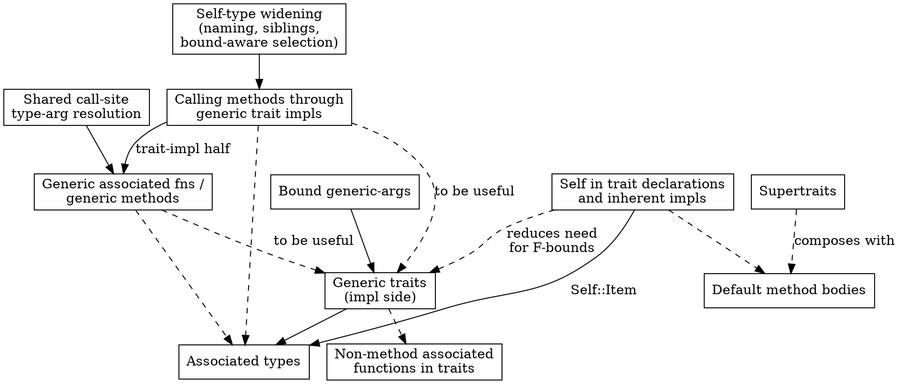

<!--
SPDX-FileCopyrightText: 2026 Jonathan Haigh

SPDX-License-Identifier: MPL-2.0
-->

# Generics/traits: gap assessment and build order

## Purpose

Leech's generics and traits are usable but incomplete. This document catalogs
every known gap, assesses each one's feasibility and cost, identifies
prerequisites between them, and recommends a build order. It is **not** an
implementation design for any individual feature — each gap gets its own
brainstorming session and spec when its turn comes. Cost is expressed
narratively (difficulty, risk, what it touches), not as size estimates.

Two things are explicitly out of scope for this document:

- **Trait objects / dynamic dispatch.** Every dispatch mechanism described
  below is static (monomorphized or resolved at a known concrete type).
  Nothing here forecloses adding dynamic dispatch later, but it isn't one of
  the nine gaps and isn't discussed further.
- **New nominal types with impls** (e.g. a future Rust-style tagged-union
  enum type with its own inherent/trait impls). That's a separate feature
  with its own design. It's referenced below only where it changes how
  cheaply a gap's mechanism could generalize — see
  [Architecture](#architecture).

## Executive summary

Recommended order, driven by dependencies and cost, not by preference:

1. [Bound generic-args](#bound-generic-args) — trivial, isolated, and a hard
   prerequisite for bounds like `T: Container[i32]`.
2. [`Self` in trait declarations](#self-in-trait-declarations) — and in
   inherent impls, which share the gap. Also small and isolated, and worth
   doing early for the same reason: it changes what later gaps have to
   accommodate. Without it a trait can't say a method takes or returns the
   implementing type, which forces F-bounded workarounds that (5) and (7)
   would otherwise have to support well.
3. [Calling methods through generic trait impls](#calling-methods-through-generic-trait-impls)
   — the mechanism already exists for structs' inherent impls; this is
   mostly generalizing and wiring it up, not inventing it. Do the
   self-type half of the [architecture prerequisites](#architecture) as
   part of this spec; the call-site half turned out not to be needed until
   (4).
4. [Generic associated functions / generic methods](#generic-associated-functions--generic-methods)
   — its inherent-impl half is independent of (3); its trait-impl half
   depends on (3). Owns the shared call-site type-argument resolution
   prerequisite, which has both of its motivating callers.
5. [Generic traits' impl side](#generic-traits) — largely orthogonal to (3)
   and (4) mechanically, but only pays off once they exist (a generic trait
   impl that's itself generic needs both).
6. [Supertraits](#supertraits) and
   [default method bodies](#default-method-bodies) — independent of each
   other and of everything above; can slot in anytime after (3)/(4) land,
   since default bodies want the same "check once against `Self`,
   instantiate per caller" substitution those establish, and want (2) to
   name `Self` at all.
7. [Non-method associated functions in traits](#non-method-associated-functions-in-traits)
   — benefits from (5) if you want `SomeGenericTrait[i32]::method()`, but its
   real cost is new dispatch design, not a dependency.
8. [Associated types](#associated-types) — last. The largest and most novel
   gap; benefits most from every other piece already being solid.

See [Dependency graph](#dependency-graph) for the full picture, including
edges that are soft (helpful) rather than hard (blocking).

## Architecture

Before assessing individual gaps, two cross-cutting findings shape several of
them. Neither warrants a standalone refactor project — both are scoped as
prerequisite line items inside the first feature spec that needs them.

### Generic instantiation is a general mechanism, gated by call site

`ir_module.Fn` / `FnInstance` don't inherently care whether a function is
free, an inherent method, or (in principle) a trait-impl method.
`Fn.impl_instance` already accepts an impl's self type *and* the method's own
`typ_args` as independent inputs — the data model already anticipates a
generic method on a generic impl.

What's actually missing is call-site plumbing: `typcheck.py`'s
`_resolve_generic_call` / `_infer_typ_args` / `_resolve_explicit_typ_args`
only run for a `VarExpr` callee (a free function called by name). Dot-call
resolution (`_resolve_callee`'s `FieldAccessExpr` branch) never performs
type-argument inference or substitution for methods at all — it takes
whatever `Fn`/`FnInstance` `ir_traits.lookup_member` returns and uses its
`fn_typ` as-is. The grammar doesn't even have a place to write explicit type
arguments on a dot-call (`x.method[i32]()`) or a path-call to an associated
function (`Foo::method[i32]()`) — `FieldAccessExpr` has no `generic_args`
field, unlike `VarExpr`.

Consequence: [generic methods](#generic-associated-functions--generic-methods)
isn't "invent instantiation for methods," it's "extend the existing
free-function call-site logic to two more call shapes."

An earlier version of this document also assigned this prerequisite to
[calling methods through generic trait impls](#calling-methods-through-generic-trait-impls),
on the grounds that it needs the same logic once it starts building
`FnInstance`s for trait-impl methods. It doesn't. A method reached through a
generic trait impl introduces no type parameters of its own — those are gap
4 — and the impl's own parameters are inferred from the self type inside
`FnInstance.__init__`, not at the call site. Gap 3 therefore has no
call-site type arguments to resolve, and extracting a shared helper against
its single caller would be designing it blind. This prerequisite belongs
wholly to [generic methods](#generic-associated-functions--generic-methods),
which has both of the callers that motivate sharing it.

### The self-type restriction to `StructTyp` looks incidental

`Fn.impl_instance` asserts its self type is a `typs.StructTyp`
(`FnInstance.__init__`, `FnInstance.substitute_typ_params` do too), but the
only operations it performs on that self type — `infer_typ_args`,
`substitute_typ_params` — are defined generically on the `Typ` base class,
not on `StructTyp` specifically. The restriction exists only because inherent
impls are `StructTyp`-only today (`ir_module._build_inherent_impl_defn`
raises `ImplForNonStructTypError` for anything else, and only `StructTyp`
carries an `assoc_fns` store). Trait impls already allow *any* `Typ` as self
type (`ir_traits.Impl._self_typ: typs.Typ`) — they just don't reuse
`impl_instance` yet, which is exactly what blocks
[calling methods through generic trait impls](#calling-methods-through-generic-trait-impls).

Widening `Fn.impl_instance`'s self-type parameter from `StructTyp` to `Typ`
looks mechanical rather than a deep redesign, since the substitution
operations it calls are already type-agnostic — but it isn't self-contained,
and an earlier version of this document understated that.
`FnInstance.sibling_instances` (used by `CfgBuilder._resolve_sibling` to let one method
in an impl block call another without re-resolving from scratch) walks
`StructTyp.assoc_fns` and asserts `isinstance(recv_typ, typs.StructTyp)` on
the *instance's own* receiver type — and `_resolve_sibling` runs for every
`ir_module.Fn`-valued reference inside an instantiated method's body, not
only genuine impl-block-sibling calls: `CfgBuilder._build_var_expr` calls it
for any resolved free-function reference, and `sibling_instances` being a
cached property means merely accessing it (`self._fn.sibling_instances.get(...)`)
forces that assert regardless of whether the reference in question is
actually a sibling. Once a trait-impl method can build a `FnInstance` with a
non-`StructTyp` self type, that assert becomes reachable through something as
mundane as calling an ordinary free function from inside the method body, and
crashes compilation.

An earlier version of this document proposed fixing this by guarding on
`isinstance(recv_typ, StructTyp)`, on the theory that sibling remapping has
no trait-impl equivalent need. That's wrong, and worth correcting rather than
repeating: a generic trait impl's own method calling *another method of the
same impl* on `self` (not a field) — e.g. `eq` calling `self.cmp(other)`
inside `impl[A: Show, B: Show] Ord for Pair[A, B]` — is typechecked once
against the impl's own abstract self type, exactly like the inherent case,
and resolves to the same kind of unsubstituted sibling `Fn` that needs
remapping to the concrete instantiation at lowering time. That's true whether
the impl is inherent or a trait impl, and independently of whether the self
type happens to be a `StructTyp` — a StructTyp-based guard wouldn't even
distinguish the two (a generic trait impl's self type can itself be a
`StructTyp`, like `Pair[A, B]` above), so it would silently misroute rather
than crash in that case. Fixing this properly means basing
"siblings" on the impl block a `Fn` was declared in, uniformly for inherent
and trait impls, rather than on `StructTyp.assoc_fns` specifically.
`ir_traits.Impl` doesn't expose an enumerable collection of its own methods
the way `StructTyp.assoc_fns` does (only a `TraitMethod`-keyed lookup), but
it turns out not to need one: `ir_module._build_impl_fns` already constructs
one block's functions in a single loop and can hand each the list. Resolved
in [gap 3's own spec](2026-08-13-generic-trait-impl-calls-design.md), which
also records why that is behaviour-preserving for the inherent case.

One correction, from actually running it: the sibling *call* itself doesn't
reach the assert described above. `sibling_instances` returns an empty map,
because a trait impl's methods live on `ir_traits.Impl` and never enter
`StructTyp._members`, so the unsubstituted `Fn` reaches codegen and fails
there instead. The assert is a genuine second failure, but reaching it needs
a non-`StructTyp` self type — which is why an ordinary free-function call
from such a method is the case that exposes it.

A second, separate piece is missing alongside the `sibling_instances` fix:
symbol naming. `FnInstance.qualified_name` (`ir_module.py:400`) builds every
generic instance's mangled LLVM symbol name, and for any impl-instance
(`self._self_typ is not None`) it joins `self._self_typ.qualified_name` with
`self.name` — but `qualified_name` (`typs.py:545`) is defined on `StructTyp`
only; it isn't on the `Typ` base class or any other subclass. Every
generic-impl-method instance the compiler emits goes through this, not just
ones a particular call pattern happens to reach, so a non-`StructTyp` self
type hits an `AttributeError` here regardless of what the method's body does.
Reusing `.name` (which *is* on the base `Typ` class) instead isn't a
like-for-like swap, either: it drops the module qualification
`StructTyp.qualified_name` provides, and — more importantly for a trait impl
specifically — it isn't collision-free on its own. A non-generic trait impl
already solves this today via `ir_traits.Impl.name`
(`f"<{self._self_typ.name} as {self._trait.name}>"`) precisely so that, say,
`impl Show for Foo` and `impl OtherTrait for Foo` each defining a method
named `show` don't collide — the trait name is the discriminator.

The fix doesn't need `Fn` to carry a reference to its owning `Impl`/`Trait`
*object* — an earlier version of this document overstated that.
`ir_module._build_impl_fns` already computes `Impl.name` (passed in as
`qualified_prefix`), but only ever uses it for a non-generic impl's
`_add_item` call; for a generic impl it's computed and then discarded
outright without ever reaching `Fn`. Threading that exact string through
unchanged, as-is, wouldn't be correct either, though: it's built from the
*impl's own* abstract, unsubstituted self type (e.g. literally rendering as
`"Pair[A, B]"`, with `A`/`B` still type parameters) — one fixed string per
impl template, shared by every instantiation, not one per instantiation.
Storing it verbatim on `Fn` and reusing it for every `FnInstance` would give
every instantiation of a generic trait impl's same-named method the
identical mangled symbol (a `Pair[i32, i32]` instantiation and a
`Pair[bool, bool]` instantiation of `impl[A: Show, B: Show] Show for
Pair[A, B]` would both mangle to `<Pair[A, B] as Show>::show`), colliding at
the LLVM level. The correct minimal fix sits between the two extremes: thread
just the trait's *name* onto `Fn` — a plain string, not the whole precomputed
`Impl.name` and not an object reference — and have `FnInstance.qualified_name`
combine that string with the *instance's own* concrete self type at each
instantiation, reconstructing the `<SelfTyp as Trait>` shape `Impl.name`
already uses, but built fresh per instance from the concrete self type rather
than baked in once from the abstract one.

That still isn't enough on its own, though: both halves of `<SelfTyp as
Trait>` need to be *module*-qualified, not just their bare names, or two
modules that happen to reuse the same short name — either a struct name
(`Pair`) or a trait name (`Show`) — collide. `StructTyp.qualified_name`
already gets this right for the self-type half in the *inherent*-impl case
(`main::Pair[i32, i32]`, not just `Pair[i32, i32]`); the fix must not lose
that when generalizing to non-`StructTyp` self types. The cleanest way to
keep it is to make `qualified_name` a `Typ`-base-class property in the first
place (default `= self.name`, correct as-is for builtin types like `i32`,
which aren't declared in any module and need no qualifier) — rather than
`FnInstance` special-casing `.name` vs `.qualified_name` itself.

A default plus `StructTyp`'s existing override isn't sufficient, though, as
an earlier version of this document assumed. Qualification has to be
*recursive*, because a type can contain another: `*T` and `[T; 3]` render
their pointee and element with `.name`, and `StructTyp.name` renders its own
type arguments the same way — so `Box[a::Foo]` and `Box[b::Foo]` already
mangle identically today, with no generic trait impl involved at all.
`PtrTyp`, `ArrayTyp` and `EnumTyp` need their own overrides, and
`StructTyp`'s must be re-derived over its arguments' qualified names. See
[gap 3's spec](2026-08-13-generic-trait-impl-calls-design.md).

On the trait side, `Trait` already carries its own
`mod_name`, so the string threaded onto `Fn` should be
`f"{trait.mod_name}::{trait.name}"`, not the bare trait name — still a plain
string, still no object reference, just the qualified one. Small once
identified, but a second, independent prerequisite the self-type widening
doesn't cover on its own, and worth its own regression tests: two
instantiations of the same generic trait impl's method (distinct symbol
names), and two same-named traits or self types declared in different
modules (also distinct symbol names).

This generalization is also relevant beyond these nine gaps: a future
non-`StructTyp` nominal type with its own impls (e.g. a tagged-union enum)
would reuse this same instantiation mechanism for free, needing only its own
`assoc_fns`-equivalent store and a relaxed `ImplForNonStructTypError` check —
rather than a parallel mechanism being built for it later. That's context,
not a requirement this document imposes.

### `ImplRegistry` is already narrow and extensible

`ir_traits._head_shape` special-cases `StructTyp` (keyed by `.ast` identity,
so every instantiation of one generic struct shares a shape bucket) and falls
back to `type(typ)` otherwise. It's a small, single-purpose dispatch point.
[Generic traits](#generic-traits) needs it to also account for a trait's own
type arguments (so `impl Container[i32] for Foo` and `impl Container[str] for
Foo` can coexist); a future new nominal type would need at most one more
`isinstance` branch. Called out here only to confirm it isn't a blocker for
either.

## Gaps

### Bound generic-args

**Current state.** `generic_param: ident (":" bound_list)?` and
`bound_list: path ("+" path)*` — a bound is a bare path with no
`generic_args`. `T: Container[i32]` doesn't parse.

**What's needed.** Grammar: give `bound_list`'s paths an optional
`[generic_args]`, matching how `basic_typ` already does it. `GenericParam`
(ast.py) needs to carry each bound's type arguments, not just its path.
Wherever a bound is currently resolved to a `Trait` and used for lookup
(`typcheck._resolve_bound_method`, `typs.check_typ_arg_bounds`), it needs to
carry those type arguments through to whatever [generic
traits](#generic-traits) needs from them (matching an impl's own trait type
args against the bound's).

**Feasibility & cost.** Small and low-risk. It's a narrow grammar extension
plus threading one more piece of data through code that already threads
bound paths through. On its own (without generic traits existing yet) it has
no runtime effect — it only starts mattering once something can produce a
`Trait` with type arguments to check against. It's worth doing first anyway:
it's cheap, isolated, and doing it before generic traits avoids designing
generic traits' bound-checking against a bound representation that can't
express what it needs to check.

**Dependencies.** None. Hard prerequisite for the bound-checking half of
[generic traits](#generic-traits).

### `Self` in trait declarations

**Current state.** `Self` is bound in exactly one place: `Impl.__init__`
(`self.env.add_container("Self", self_typ)`, `ir_traits.py:133`), which
covers *trait* impls only. `Trait.__init__` binds only the trait's own
generic parameters, and `_build_inherent_impl_defn` binds only the impl's,
so `Self` resolves in neither a trait declaration nor an inherent impl. A
trait impl can name `Self`; the trait it implements cannot, and neither can
`impl Foo { ... }`. Verified by compiling both `trait Comparable { fn
cmp(*self, other: *Self) i32; }` and `impl Foo { fn twin(*self) Self {
... } }`, each failing with `ItemNotFoundError: Type or module "Self" not
found.`

The practical effect: a trait cannot state that a method takes or returns
the implementing type. `fn cmp(*self, other: *Self) i32` is inexpressible,
so the only way to write such a trait today is to add a type parameter and
have every use site bound it F-style (`trait Comparable[T]` used as
`fn max[T: Comparable[T]]`) — which needs [bound
generic-args](#bound-generic-args) and [generic traits](#generic-traits)
just to say something `Self` says directly.

**What's needed.** `Self` is resolved as a *name*, bound per context to
whatever type it stands for there — not represented as a type of its own.
`TraitMethod.fn_typ_for_self` is the only place a trait method's parameter
and return types are ever resolved, and every caller already supplies a
concrete self type, so it can resolve them in a child env binding `Self` to
that type. Inherent impls need the same one-line binding trait impls
already have. `Self` also becomes a reserved name, rejected at generic
parameter and type declarations, since it is otherwise a plain identifier.
The impl side needs no change: `Impl.add_method` compares `fn.fn_typ is not
trait_method.fn_typ_for_self(self._self_typ)` (`ir_traits.py:179-183`), and
an impl's env already binds `Self` to its concrete self type, so an impl may
write either `Self` or the concrete type and both intern to the same
`FnTyp`.

Fully designed in
[Bind `Self` in trait declarations and inherent impls](2026-08-11-self-in-traits-design.md),
including why an abstract `TypParamTyp` placeholder was considered and
rejected for this gap.

**What this does not give you.** `Self` in *signatures* only. Under
name-binding no `Self`-typed value ever exists — `Self` always resolves to
a real type — so there is nothing to call a method *on*, and nothing here
breaks. What is missing is the *abstract* `Self` needed to type-check a
body once, independently of any implementer. Introducing that is
straightforward under name-binding (bind `Self` to a placeholder instead of
to a concrete type), but the placeholder alone is not enough: method lookup
on it must also find the declaring trait's methods. See [default method
bodies](#default-method-bodies), which needs both and is where they belong.

**Feasibility & cost.** Small. It adds no type, no substitution pass and no
cache-key decision; the impl-side comparison falls out for free because
both sides already funnel through `fn_typ_for_self`. Binding rather than
substituting also removes a class of bug outright — an unsubstituted `Self`
cannot escape into type checking or codegen, because `Self` never becomes a
`Typ`. The reservation check is the only part touching code beyond the two
binding sites. (It was later generalized to keywords and builtin type
names across both namespaces — see
[reserved names](2026-08-13-reserved-names-design.md).) The "small" holds only for
the scope above — signatures, not bodies.

**Dependencies.** None — it's independent of every other gap here. It
should come early regardless of when its dependents do, because it changes
what the *other* features have to accommodate: [default method
bodies](#default-method-bodies) will want `Self` in signatures and bodies,
[associated types](#associated-types) need `Self::Item` projections to
resolve `Self` in the first place, and having `Self` removes most of the
pressure for F-bounded workarounds in [generic
traits](#generic-traits).

### Calling methods through generic trait impls

**Current state.** `ir_traits.lookup_member` finds a matching `Impl` and
method via structural matching (`_typs_overlap`/`infer_typ_args`), but then
asserts `method.recv_typ is typ` — i.e. it only actually works when the impl
wasn't generic to begin with, so the found method's literal receiver type
already equals the concrete type being looked up on. Two tests
(`test_calling_method_through_generic_impl_not_supported_yet`,
`test_trait_bound_call_through_generic_impl_not_supported_yet`) pin this down
as an `AssertionError`.

**What's needed.** Once the found method's receiver doesn't match the
concrete type exactly, build a `FnInstance` the way `Fn.impl_instance`
already does for generic inherent impls, substituting the *impl's* type
parameters (inferred from matching its self type against the concrete type)
throughout the method's body — after widening `impl_instance`'s self-type
parameter per [Architecture](#architecture) above, since a trait impl's self
type isn't restricted to `StructTyp`. That widening must also address two
problems the type-signature change alone doesn't cover (see
[Architecture](#architecture)): `FnInstance.sibling_instances` needs a
same-impl-block sibling-resolution mechanism that works for a trait impl
(not just a `StructTyp`-based guard, which this document tried and rejected
twice — see [Architecture](#architecture) for why), and
`FnInstance.qualified_name` needs module-qualified, collision-free mangled
names for a non-`StructTyp` impl instance (a recursive `qualified_name` on
`Typ`, plus threading each trait impl's own module-qualified trait name onto
`Fn`).

A third piece, which this document missed entirely: an impl's own bounds
(`impl[T: Show] Show for Box[T]`) are not consulted when selecting an impl,
so `Box[bool]` matches and then dies at lowering on a bare
`assert impl is not None`. That is pre-existing — the inherent form fails
the same way — but gap 3 opens a second route to it, and the fix is
selection-shaped rather than a check to bolt on: an unsatisfied bound means
the impl doesn't apply.

Fully designed in
[Calling methods through generic trait impls](2026-08-13-generic-trait-impl-calls-design.md),
which reproduced each of these against a spike rather than predicting them,
and corrects two of this document's predictions in the process.

**Feasibility & cost.** Medium. The core substitution mechanism
(monomorphizing a method against an impl-level substitution) is already
solved and tested for inherent impls, so this is generalizing an existing,
working mechanism to a second call site rather than designing one from
nothing — that part's risk is low. But two supporting pieces the widening
doesn't cover on its own turned out to need real thought rather than being
incidental: symbol naming (module-qualification was the catch, and it has to
be recursive) and sibling resolution (the guard-based fix this document
proposed twice was wrong both times, most recently because a generic trait
impl can itself have a `StructTyp` self type, which a `StructTyp`-based
guard can't distinguish from the inherent case it's meant to exclude). Both
are explicit line items in the spec, as is bound-aware impl selection, which
this document didn't anticipate at all and which is the one piece that
widened the feature rather than just generalizing it.

**Dependencies.** Needs the architecture prerequisites above. Nothing else
blocks it — it doesn't need [generic traits](#generic-traits) (the trait
itself need not be generic; only the *impl* is), and it doesn't need
[generic methods](#generic-associated-functions--generic-methods) (the
method itself need not introduce new type parameters beyond the impl's).

### Generic associated functions / generic methods

**Current state.** `ir_module._build_impl_fns` asserts
`not fn_ast.generic_params` for every function inside any impl block
(inherent or trait, generic or not) — "generic associated functions aren't
supported yet." Even where this weren't blocked, dot-call resolution
performs no type-argument inference or substitution at all (see
[Architecture](#architecture)), and the grammar has no syntax for explicit
type arguments on a dot-call or an associated-function path-call.

**What's needed.** Lift the assert. Extend `FieldAccessExpr` (grammar and
ast.py) with an optional `[generic_args]`, matching `VarExpr`/`basic_typ`.
Extract the type-argument resolution logic currently private to
`_resolve_generic_call` into something callable from `_resolve_callee`'s
method branch and from path-calls to associated functions, covering both
explicit type arguments and inference from call-site argument types. Extend
`check_typ_arg_bounds` calls accordingly.

This splits into two genuinely independent sub-cases:

- **Inherent-impl methods** (generic or non-generic struct, method
  introduces its own type parameters): no dependency on trait impls at all —
  `Fn.impl_instance` already supports a method's own `typ_args` layered over
  an impl's self-type inference (see [Architecture](#architecture)).
- **Trait-impl methods**: needs [calling methods through generic trait
  impls](#calling-methods-through-generic-trait-impls) to exist first, since
  it's the same "build a `FnInstance` for a method reached through a trait
  impl" mechanism, just with an extra layer of the method's own type
  parameters on top.

**Feasibility & cost.** Medium. The substitution/instantiation side is
low-risk (same reasoning as the previous gap: the mechanism already exists
and is tested). The real cost is the call-site resolution work — sharing
inference/explicit-args logic across three call shapes (free-function
`VarExpr`, dot-call `FieldAccessExpr`, path-call to an associated function)
without three divergent copies — and the grammar extension. Non-generic
associated functions and methods are unaffected; this only touches the path
where `fn_ast.generic_params` is non-empty.

**Dependencies.** Inherent-impl half: none beyond the architecture
prerequisites (shared call-site logic). Trait-impl half: [calling methods
through generic trait impls](#calling-methods-through-generic-trait-impls).

### Generic traits

**Current state.** The trait-declaration side already works: `trait_defn`'s
grammar has `[generic_params]`, and `ir_traits.Trait.__init__` already binds
a trait's own type parameters into its env, used when resolving each
`TraitMethod`'s signature. The impl side is explicitly blocked:
`ir_module._build_trait_impl_defn` asserts
`not trait_typ_ast.generic_args` — "generic traits aren't supported yet" —
so `impl Container[i32] for Foo` can't be written even though `trait
Container[T] { ... }` parses.

**What's needed.** Resolve a trait reference's `generic_args` in an `impl`
block into concrete type arguments for the trait (or type parameters, for a
generic impl of a generic trait), threading them through `Impl` so
`TraitMethod.fn_typ_for_self` resolves against the right binding for the
trait's own parameters, not just `Self`. `ImplRegistry` needs to key on
`(Trait, trait_typ_args, self_typ_shape)` rather than `(Trait,
self_typ_shape)`, so two impls of the same trait with different trait type
arguments for the same self type can coexist without the current logic
treating them as conflicting; `_typs_overlap`-style conflict detection needs
to compare trait type arguments too, not just self types. [Bound
generic-args](#bound-generic-args) needs to exist for `T: Container[i32]`
bounds to be checkable against these impls.

**Feasibility & cost.** Medium. The declaration side being already built
lowers the risk considerably — this is filling in one side of a mechanism
that already half-exists, not building both halves from scratch. The main
design work is `ImplRegistry`'s keying and conflict detection, which need
real thought (structural overlap checking across two dimensions — self type
and trait type args — rather than one), and deciding how a generic impl's
own type parameters interact with the trait's type parameters when both are
in play (e.g. `impl[T] Container[T] for Vec[T]`). Largely orthogonal to
[calling methods through generic trait impls](#calling-methods-through-generic-trait-impls)
and [generic methods](#generic-associated-functions--generic-methods)
mechanically — a generic trait's impl need not itself be generic, and its
methods need not introduce new type parameters — but a fully generic
scenario (generic trait, generic impl, generic method all at once) needs all
three gaps working together, so it only becomes fully useful once they do.

**Dependencies.** [Bound generic-args](#bound-generic-args) for the bounds
half. No hard dependency on the other gaps, though it composes with them.

### Supertraits

**Current state.** No supertrait syntax at all — a trait can't declare that
implementing it requires also implementing another trait.

**What's needed.** Grammar: a bound-list-like clause after a trait's name
(`trait Ord: Eq { ... }`). Two validations, at two different times, not one
check at impl-registration time:

- **Supertrait cycles** (`trait A: B` / `trait B: A`), checked when resolving
  a trait's own supertrait list to `Trait` objects, independent of impl
  registration order entirely — analogous to existing struct-field-cycle
  detection.
- **"Every supertrait is also implemented"**, which must *not* be checked
  inside `ImplRegistry.add_impl` itself. `add_impl` runs incrementally, as
  each `impl` block is built during module loading
  (`ir_module._build_trait_impl_defn`), so a same-time-as-registration check
  is order-dependent in a way the registry's existing checks aren't: the
  orphan-rule and conflicting-impls checks are symmetric (whichever of two
  conflicting impls is registered second always sees the first already
  present, so either declaration order self-corrects), but "does `Foo` also
  implement `Eq`" is not — `impl Ord for Foo` declared (or loaded, across
  modules) before `impl Eq for Foo` would be wrongly rejected even though the
  finished program satisfies the constraint. This needs deferring to a
  separate, whole-program pass after every module is loaded and every impl
  registered — which has direct precedent already: `codegen.Compiler.compile()`
  already runs exactly this kind of deferred, whole-program validation sweep
  for generic struct templates and enums (`codegen.py`, the loop that forces
  `.fields`/`.backing_typ` over every `_program_items()` entry). Supertrait
  obligations are a natural addition to that same pass, or a sibling pass run
  alongside it, rather than a new mechanism.

Bound resolution (`typcheck._resolve_bound_method`) needs to walk supertrait
bounds transitively, so `T: Ord` also satisfies a lookup for an `Eq` method.

**Feasibility & cost.** Small-medium. It's additive: a cycle check at
trait-declaration time, a transitive walk where bounds are already walked
once, and — this is the part worth calling out explicitly, since a naive
implementation gets it wrong — an obligation check that must live in the
existing deferred whole-program validation pass rather than at impl
registration, precisely to avoid the impl block's own source (or module load)
order determining whether a correct program compiles. Given the existing
pass to extend, this is a real but bounded addition, not a new subsystem. No
interaction with the generic-instantiation machinery at all — it's purely
about which impls are legal and which methods a bound can see, not about
substitution. The remaining design decision is error messaging (what's
reported when a supertrait is missing) and whether supertrait bounds can
themselves be generic once [generic traits](#generic-traits) exists — not a
blocker, just a detail to settle when its spec is written.

**Dependencies.** None.

### Default method bodies

**Current state.** `trait_fn: _fn_prototype ";"` — a trait method is always a
prototype with no body. `TraitMethod` has no notion of one.

**What's needed.** Grammar: let a trait method have a body instead of a
semicolon (`_fn_prototype (";" | block_expr)`). Type-check a default body
once, against an abstract `Self`, the same way a generic function's body is
checked once against its own type parameters (an existing, working pattern
— see `Fn.typ_check_results`) rather than once per implementer. [`Self` in
trait declarations](#self-in-trait-declarations) makes `Self` resolve as a
name bound per context, but always to a *concrete* type; this gap adds the
abstract case, by binding `Self` to a placeholder when checking a body
instead of to an implementer's type. That reuses the binding mechanism
rather than replacing it, but the placeholder itself is new work here.
`Impl.check_complete` needs to stop requiring every method when
one has a default, and dispatch (`ir_traits.lookup_member`/`Impl.get_method`)
needs to fall back to the trait's default, instantiated against the
concrete `Self`, when an impl doesn't override it.

Crucially, a default body needs to call the trait's *other* methods on
`self` — `fn a(*self) { self.b(); }` is core default-method behavior, not an
edge case. That is the main piece of new machinery this gap needs, and an
abstract `Self` alone does not provide it. If the placeholder is a
`TypParamTyp`, method lookup on it consults only that parameter's declared
bounds (`typcheck._resolve_bound_method`), and it has none, so `self.b()`
fails to resolve during the check-once phase — before any substitution
could help. Resolution has to be taught that an abstract `Self` belongs to
its declaring trait and that the trait's own methods are in scope on it.
Two plausible shapes, to be chosen in this gap's own spec: give the
placeholder an explicit link to its declaring `Trait` and extend the
`TypParamTyp` branch of `_resolve_callee` to consult it, or give it a
synthetic bound naming its own trait so the existing
`_resolve_bound_method` path works unchanged. Once
[supertraits](#supertraits) exist, this lookup needs to search them too.

**Feasibility & cost.** Medium. Three separable pieces: the grammar and
completeness/dispatch changes above; an abstract `Self` placeholder; and
same-trait method resolution on it. The first is routine. The second is
small — [`Self`](#self-in-trait-declarations) establishes that `Self` is a
name bound per context, so the abstract case is a different binding, not a
different mechanism. The third is where the risk concentrates and is
genuinely new: it is the one part no earlier gap sets up, and the reason
this gap is not merely "a generic function with one implicit type
parameter" — a generic function's type parameter carries bounds that make
method calls on it resolve, and `Self` has none.

**Dependencies.** [`Self` in trait
declarations](#self-in-trait-declarations) — not strictly blocking, but it
establishes the binding mechanism and gets `Self` resolving in signatures,
so doing it first leaves this gap with only the abstract binding and the
resolution work. Composes naturally with [supertraits](#supertraits) (a
default body calling a supertrait method).

### Non-method associated functions in traits

**Current state.** `TraitMethod.__init__` raises
`TraitMethodMissingReceiverError` whenever a trait function has no receiver
— deliberately disallowed. Separately, associated-function path-calls
(`Foo::new()`) resolve through `ir_env.Env._resolve_path_segment`, whose
`match` only handles `Env`, `ir_module.Mod`, `typs.StructTyp`, and
`typs.EnumTyp` as a path's leading scope; for `StructTyp` it only consults
`get_assoc_fn` (inherent associated functions), never the impl registry, so
even today's `Foo::inherent_fn()` doesn't see trait-provided members.

**What's needed.** Drop the receiver requirement for a trait function that's
meant to be non-method. The harder part is dispatch, which is genuinely new
design, not assert-lifting: `_resolve_path_segment` needs new cases for
`ir_traits.Trait` (explicit `Trait::fn()`, needing an explicit `Self` from
somewhere — a type argument, or context — since there's no receiver value to
infer it from) and `typs.TypParamTyp` (`T::fn()` inside a generic body,
dispatching against `T`'s declared bounds the way `_resolve_bound_method`
already does for method calls). Whether `Foo::fn()` should also start
consulting the impl registry for a concrete `Foo` (true UFCS-style lookup) is
a design decision this doc doesn't resolve — it's exactly the kind of
question the feature's own brainstorming session should settle.

**Feasibility & cost.** Medium-large. Not because the mechanism is missing —
once a `Self` type is known, resolving and calling the function reuses
existing machinery — but because *finding* the right `Self` is a real design
problem with more than one plausible answer (explicit type argument syntax,
inference from expected return type, inference from other arguments), and
the codebase's current member-lookup model (`lookup_member`) assumes it's
always starting from a known concrete type, not synthesizing one. This is
the gap most likely to need its own exploratory brainstorming rather than a
mostly-mechanical spec.

**Dependencies.** None hard. Composes with [generic
traits](#generic-traits) if explicit syntax like
`SomeGenericTrait[i32]::fn()` is wanted, but a first version could ship
against non-generic traits only.

### Associated types

**Current state.** No support at any layer — no grammar for `type Name;`
inside a trait or `type Name = SomeTyp;` inside an impl. Whether `T::Item`
would even parse as a type today is untested, though `basic_typ: path
[generic_args]` and multi-segment `Path` suggest the grammar wouldn't need
much syntax work; the type-checking side has nothing analogous at all.

**What's needed.** Grammar for declaring an associated type in a trait
(optionally with bounds, mirroring `generic_param`) and defining it in an
impl. A place to store them on `Trait`/`Impl`, parallel to how methods are
stored. Resolution of a projection type (`Self::Item` inside a trait's own
method signatures/bodies, `T::Item` inside a generic function bound by that
trait, `SomeConcreteTyp::Item` when known) into a concrete `Typ` — this is
new type-system machinery, not an extension of an existing pattern: neither
`typs.py`'s substitution model nor `TypParamTyp` currently represents "a type
that depends on which impl is selected." It also interacts with a generic
impl's own type parameters (`impl[T] Iterator for Vec[T] { type Item = T;
}`), meaning an associated type's concrete value can itself need
substitution before use.

**Feasibility & cost.** Large. This is the one gap that's a genuine
type-system extension (a projection/associated-type mechanism) rather than
generalizing or wiring up something that already exists elsewhere in the
codebase. Every other gap in this document reuses a pattern Leech already
has somewhere (generic function instantiation, bound resolution, path
resolution); this one doesn't. Cost and risk are comparable to what
associated types cost in comparably-scoped languages generally — expect it
to need its own multi-stage design (declaration → resolution → substitution
→ interaction with generic impls) rather than a single spec.

**Dependencies.** Wants [generic traits](#generic-traits) to exist first
(the general `impl[params] Trait for Typ { type X = ...; }` shape is the
common case), and benefits from [calling methods through generic trait
impls](#calling-methods-through-generic-trait-impls) and [generic
methods](#generic-associated-functions--generic-methods)'s substitution
groundwork, since resolving `Self::Item` inside a method body is the same
kind of substitution problem those establish machinery for.

## Potential future work

Items deferred out of a gap's own spec. Each is a real limitation with a
known shape, not a speculative feature; none blocks anything above. Most are
small; the two impl-unification entries are not, and say so.

- **`Self` in a trait's own generic-parameter bounds**
  (`trait Convert[T: Convert[Self]]`, `trait Graph[N: Node[Self]]`).
  Deferred from the [`Self`](#self-in-trait-declarations) spec. Bounds
  resolve through `typs.check_typ_arg_bounds` in an env derived from the
  instantiation site rather than from the trait, so `Self` doesn't resolve
  there. The fix is to thread the current self type down alongside the
  existing `in_progress` parameter; note that binding `Self` to the type
  argument being checked is *wrong*, because `Self` refers to the enclosing
  obligation's subject, not the current one. Worth doing once [generic
  traits](#generic-traits) land: these two bound families are exactly the
  ones that stay useful after `Self` exists, and both are why recursive
  bounds are detected rather than rejected outright.
- **Reify inherent impl blocks, so impl selection exists once.** Not small.
  Raised by a design-depth review of
  [gap 3](2026-08-13-generic-trait-impl-calls-design.md), which made the
  duplication complete rather than partial.

  `ir_traits.ImplRegistry.find_impl` and `typs.StructTyp._scan_generic_assoc_fn`
  now run the same algorithm — match a generic impl's self type against a
  concrete one, then gate on the impl's own bounds — in two modules that
  import each other in a cycle. Gap 3 factored out the matching half as
  `typs.match_typ_args`; the gating half is still written twice.

  The reason is that an inherent `impl` block is never reified. There is no
  object for one, so the inherent path recovers "which generic impl blocks
  exist" by scanning a struct template's instantiations for non-concrete
  ones that happen to carry the member — the block inferred from a side
  effect of having been built. That already costs: conflicting generic
  inherent impls are an `assert` rather than `ConflictingImplsError`, and
  the impl-selection recursion guard exists only on the trait path.

  The fix is to give inherent blocks an `Impl` with an optional trait and
  register them in `ImplRegistry` alongside trait impls, so one `find_impl`
  serves both. `_scan_generic_assoc_fn`, `_generic_assoc_fn_cache` and the
  template-instance scan all go. It touches `StructTyp.get_assoc_fn`,
  `lookup_member`, `Mod._build_inherent_impl_defn` and
  `mono._generic_impl_method_fns` — too much to fold into a feature spec,
  and worth doing before impl selection grows any further (specificity,
  negative reasoning, where-clauses would each otherwise be written twice).

- **One producer for an impl method's symbol name.** Blocked on the entry
  above. `ir_traits.Impl.name` (plus `ModItem`'s module prefix) and
  `ir_module.FnInstance.qualified_name` both build the `<SelfTyp as Trait>`
  shape, and already differ: a non-generic impl emits
  `m::<Foo as Show>::show`, a generic instance
  `<m::Box[m::Foo] as m::Show>::show`. Both are collision-free, so this is
  duplication rather than a defect. `Fn` also carries the trait as a
  pre-flattened `trait_name` string it can't ask anything else of; the
  natural fix is one `Impl.qualified_name` and a single `Fn.impl`
  reference replacing `trait_name`, `impl_siblings` and `qualified_prefix`
  — which needs an `Impl` to exist for inherent blocks first.

- **Trait impl method visibility.** Needs its own spec; the shape is
  settled, the plumbing isn't. Found while testing
  [gap 3](2026-08-13-generic-trait-impl-calls-design.md).

  A trait impl's methods default to private, and one `Access` drives both
  enforcement points: `typcheck` rejects `x.show()` from another module,
  and `codegen._program_items` yields an imported item only when it's
  public, so the symbol is never declared there. Writing `pub fn show`
  inside the impl already flips both and works end to end — nothing else
  blocks cross-module calls.

  But the default is backwards and the privacy isn't real:
  `typcheck._resolve_bound_method` never applies the accessibility check,
  so a call routed through a bound (`fn call[T: a::Show](x: T)`) reaches a
  private method, type-checks, and then **crashes codegen** with a
  `KeyError` for the undeclared symbol. Separately, a *private* trait's
  method is already callable from any module, because `lookup_member`
  never consults trait visibility.

  Decision: a trait impl method's visibility is **the trait's**, as in
  Rust, where writing `pub` there is an error (E0449). Implementing a
  trait is a promise to provide its interface, and anyone who can name
  the trait can dispatch through it, so per-impl privacy is meaningless.
  `Trait` doesn't currently know its own access — the `ModItem` holds it
  — so that needs threading, and the spec should decide how far to go on
  the second leak, which needs `lookup_member` to consider whether the
  caller can name the trait at all.
- **Unconstrained impl type parameters** (`impl[T, U] Box[T] { ... }`).
  Accepted silently today. `U` is never inferred from the self type, so it
  is never bound and never bound-checked; a method body naming it would leak
  an abstract type into lowering. Rust rejects these outright (E0207).
  Deferred from [gap 3's spec](2026-08-13-generic-trait-impl-calls-design.md).
- **`Self` in struct definitions** (`struct Node { next: *Self }`). Sugar
  only — `struct Node { next: *Node }` already works.
- **Trait objects / dynamic dispatch.** Out of scope for this document (see
  [Purpose](#purpose)), recorded here so it isn't lost.
- **Minimising `mono.discover`'s over-approximation.** It reports any
  instance a template's cache holds, so validating a never-instantiated
  generic struct template can surface an unused instantiation and emit a
  dead LLVM struct type. Harmless but untidy; see the
  [mono module design](2026-08-07-mono-module-design.md) for the analysis
  and the recommended narrow fix.

## Dependency graph

Solid edges are hard prerequisites; dashed edges are "helps, not required."

## Non-goals

- No implementation design for any individual gap — see [Purpose](#purpose).
- No decision on trait objects/dynamic dispatch.
- No design for a future tagged-union/enum-with-impls type; referenced only
  as context in [Architecture](#architecture).
