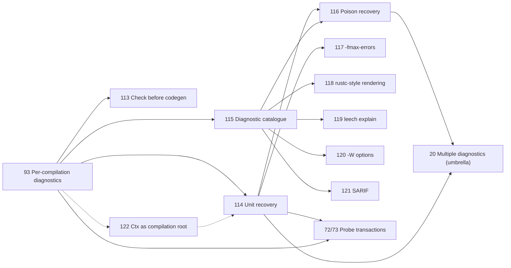

<!--
SPDX-FileCopyrightText: 2026 Jonathan Haigh

SPDX-License-Identifier: MPL-2.0
-->

# Diagnostics: Collection, Recovery, and Reporting — Design

For: [#20](https://github.com/jonathanhaigh/leech/issues/20): Report more than one diagnostic
per compilation, [#93](https://github.com/jonathanhaigh/leech/issues/93): Move accumulated
diagnostics into per-compilation state, and
[#113](https://github.com/jonathanhaigh/leech/issues/113): Report every user error before code
generation, plus [#72](https://github.com/jonathanhaigh/leech/issues/72) and
[#73](https://github.com/jonathanhaigh/leech/issues/73) (speculative-probe diagnostics) and
the new issues #114–#122 in the [Issue breakdown](#issue-breakdown).

Implementation plan: [Diagnostics plan](../plans/2026-10-05-diagnostics.md).

## Outcome

One `leech check` reports every independent user error in the program, each exactly once,
without cascades of follow-on errors. The output is in a stable source order, in a
rustc-like format with full-span underlines and labelled secondary spans. Each diagnostic has a
stable kebab-case name: a user can look it up with `leech explain`, control it with
gcc-style `-W` flags, and consume it from tools as SARIF.

```leech
fn main() i32 {
    let a = undefined_one;
    let b = undefined_two;
    let c: i32 = a + true;
    return 0i32;
}
```

```text
error[unknown-name]: cannot find variable "undefined_one"
 --> main.leech:2:13
  |
2 |     let a = undefined_one;
  |             ^^^^^^^^^^^^^

error[unknown-name]: cannot find variable "undefined_two"
 --> main.leech:3:13
  |
3 |     let b = undefined_two;
  |             ^^^^^^^^^^^^^

error: aborting due to 2 previous errors
```

`a + true` produces no error: `a` has the poison type (see [Poison](#poison-and-expression-level-recovery)),
so anything built from it is silently poisoned too.

Inside the compiler, a diagnostic is plain data, recorded in a sink owned by one
compilation. Reporting an error returns proof that it was reported. Control flow unwinds only
to the nearest recovery boundary, and only once the error has been reported.

## Current state

These facts were checked against the repository on 2026-10-05 (commit `229f721`):

- **Diagnostics are exceptions.** `errors.py` defines 114 `UserError(Exception)` subclasses.
  Each one formats its message in its constructor and adds notes with `_add_extra`. Warnings
  (`UnreachableCodeWarning`, `UnreachableMatchArmWarning`) are `UserError` subclasses too.
  Code raises errors and *registers* warnings.
- **State is global.** `register_error` appends to the module-level `_errors` list and raises
  the module-level `_error_level`. `driver.compile_module` brackets each compilation with
  `take_errors()`. `tests/harness.isolated_diags` and `tests/doc.py` read or replace those
  private globals (#93).
- **The first error ends the compilation.** `driver.compile_module` catches the single
  escaping `UserError` and records it after any warnings (#20).
- **Semantic analysis is demand-driven.** Function signatures and bodies, module-variable
  initializers, struct fields, union variants, enum backing types and comptime parameter
  types are `functools.cached_property` values, computed when something first forces them.
  `cached_property` does not cache an exception. A failing property raises again every time
  it is forced, so catching errors at function boundaries alone would report a broken
  `struct S { s: S }` once per function that uses `S`.
- **Some errors are only found by code generation** (#113). `Mod.check_declarations`
  type-checks function bodies only. `codegen.Compiler.compile` forces struct, union and enum
  validation, and `mono.discover` forces variable initializers.
- **Speculative checks leak diagnostics** (#72, #73). Two probes check arguments without an
  expected type to infer comptime arguments: `TypCheck._infer_comptime_args` for function
  calls, and `TypCheck._variant_union_typ` for generic union-variant constructors (whose
  comment notes that it inherits both bugs). A diagnostic from either probe is reported
  twice or rejects a valid program.
- **The rendering is minimal.** `TextErrorRenderer` prints `ERROR: message`, the first line
  of the span, and a caret at its start column. It doesn't name the file or underline the
  range, and it shows each note as a separate, unconnected message.
- **Tool failures share the type.** `build.py` and `doctor.py` raise `UserError` subclasses
  (`CcNotFoundError`, `LinkFailedError`, `DoctorCheckError`, ...) without spans.
  `build._Diags` deduplicates the diagnostics of a build's per-module compilations, which
  each reload the whole program.
- **Tests depend on exceptions.** 411 `pytest.raises(errors.SomeError)` sites in 35 test
  files rely on the first error escaping. `tests/doc.py` annotates expected-error examples by
  class name (`error=ItemNotFoundError`).

## Goals and non-goals

Goals:

1. Diagnostics belong to one compilation. Independent compilations in one process never
   observe each other's diagnostics (#93).
2. One compilation reports every independent user error it reasonably can. This includes
   several errors in one function body, and several errors inside one expression where they
   are independent (#20).
3. A root cause is reported once. Nothing that follows from an already-reported error is
   reported again, whether it comes from re-forcing a lazy declaration, from a speculative
   probe, or from operating on a poisoned value.
4. Every user error is found before code generation. Code generation never runs on a
   program with errors (#113).
5. The architecture separates *what* a diagnostic says (a catalogue entry plus arguments),
   *where* it goes (a per-compilation sink), *how* analysis recovers (poison values and
   memoized unit failure), and *how* it is shown (text or SARIF renderers).
6. Each diagnostic has a stable name that users can look up (`leech explain`) and control
   (`-W` flags).

Non-goals:

- **Parse-error recovery within a file.** A parse error in the root module still ends the
  compilation, and Lark's LALR error recovery is not used, so a file reports at most one
  parse error. A parse error in an imported module rejects that `import` item like any other
  item error (see [Analysis units](#analysis-units-and-memoized-failure)), so the rest of the
  program is still checked. Several parse errors per file are a possible future issue (see
  [Future work](#future-work)).
- **Fix-it suggestions** (rustc `help:` with replacement code, Clang fix-its). The `Diag`
  model leaves room for them, but this plan neither renders nor applies them.
- **Translation.** The catalogue keeps all message text in one place, which would make it
  possible, but no localization machinery is planned.
- **Incremental compilation.** Memoized unit failure is a step towards query-shaped
  diagnostics ([#105](https://github.com/jonathanhaigh/leech/issues/105)), but nothing here
  persists across processes.
- **Better wording for specific diagnostics**, such as
  [#51](https://github.com/jonathanhaigh/leech/issues/51) and
  [#42](https://github.com/jonathanhaigh/leech/issues/42). The catalogue migration normalizes
  message *style*, not content.

## Decisions at a glance

| Question | Decision |
| --- | --- |
| Recovery granularity | Expression-level poison (`typs.ErrorTyp`), plus memoized failure of each analysis unit |
| Diagnostic representation | Immutable `Diag` values built from a catalogue of `DiagKind` entries. Not exceptions |
| Catalogue form | A Python module of constant `DiagKind` entries with `str.format` templates |
| Proof of reporting | Reporting an error returns a `ReportProof`. Poison and unit failure require one |
| Unwinding | One internal exception, `diag.ReportedError(reported)`, raised only after reporting |
| Ownership | One `diag.Diags` sink per compilation, created by the driver and reachable through `compilation.Ctx` |
| Speculative checks | Sink transactions that discard the probe's diagnostics |
| Output order | Sorted by file (module load order), then span start. Emission order breaks ties |
| Error cap | `-fmax-errors=N` (gcc spelling), default 20, `0` for unlimited. Text output only |
| Codes | Kebab-case names only (`error[unknown-name]`). No numeric codes |
| Message style | Lowercase first word, no trailing period, names in double quotes |
| Text rendering | rustc style, with colour controlled by `-fdiagnostics-color=auto\|always\|never` |
| Explanations | One Markdown file per diagnostic, packaged and doc-tested, shown by `leech explain NAME` |
| Warning control | `-w`, `-W<name>`, `-Wno-<name>`, `-Werror`, `-Werror=<name>`, `-Wno-error=<name>` |
| Machine output | SARIF 2.1.0 via `-fdiagnostics-format=sarif` |
| Internal compiler errors | Render the collected diagnostics, then report the crash as a compiler bug |
| Test assertions | Compiling with errors raises `diag.CompilationError`. Tests assert the full ordered list of kinds |

## Precedents

### How other compilers report and recover

| Compiler | Message definition | Collection | Recovery and cascade suppression |
| --- | --- | --- | --- |
| rustc | `#[derive(Diagnostic)]` structs with Fluent message files, and `Exxxx` codes with `--explain` texts | `DiagCtxt`. A `Diag` builder must be emitted or cancelled. `emit()` returns `ErrorGuaranteed`. Identical diagnostics are deduplicated by hash | `ty::Error` / `TyKind::Error` poison. Queries return `Result<T, ErrorGuaranteed>`. Callers commonly skip a diagnostic whose types `references_error()`. Compilation stops at phase boundaries (`abort_if_errors`) |
| Swift | `Diagnostics*.def` macro tables of IDs, kinds and format strings, plus diagnostic groups with Markdown educational notes | `DiagnosticEngine` with `InFlightDiagnostic`. `DiagnosticTransaction` defers diagnostics and can abort them | `ErrorType`, `Decl::setInvalid()`. The request evaluator is demand-driven, like Leech's lazy properties, and diagnoses request cycles |
| Clang | TableGen `.td` tables of IDs, default severities and warning groups | `DiagnosticsEngine` with pluggable `DiagnosticConsumer`s (text, SARIF) | Invalid-declaration flags, `RecoveryExpr`. Stops after `-ferror-limit` errors (default 20). Suppresses diagnostics after a fatal error |
| Zig | Ad hoc format strings at each `sema.fail` call. No IDs | One `ErrorMsg` per analysis unit, in `Zcu.failed_analysis` keyed by `AnalUnit` | `error.AnalysisFail` unwinds the current unit. Units that depend on a failed unit are recorded as transitive failures and report nothing. One error per unit |
| Go (`go/types`, `types2`) | `errorf` format strings with an internal error-code enum | A `Config.Error` callback. Without one, checking stops at the first error | `Typ[Invalid]` absorbs follow-on errors. "Soft" errors still permit a valid interpretation. `gc` stops after 10 errors unless `-e` is given |
| Roslyn (C#) | `ErrorCode` enum with resource strings, shown as `CSxxxx` | Diagnostics are attached to each lazily bound symbol or body and gathered on demand (`GetDiagnostics`) | `ErrorTypeSymbol` |

Sources:
[rustc dev guide: diagnostics](https://rustc-dev-guide.rust-lang.org/diagnostics.html),
[`ErrorGuaranteed`](https://rustc-dev-guide.rust-lang.org/diagnostics/error-guaranteed.html),
[`rustc_errors` (`DiagCtxtInner::emitted_diagnostics`)](https://github.com/rust-lang/rust/blob/master/compiler/rustc_errors/src/lib.rs),
[Swift `Diagnostics.md`](https://github.com/swiftlang/swift/blob/main/docs/Diagnostics.md),
[Swift `DiagnosticEngine.h` (`DiagnosticTransaction`)](https://github.com/swiftlang/swift/blob/main/include/swift/AST/DiagnosticEngine.h),
[Clang users' manual](https://clang.llvm.org/docs/UsersManual.html),
[Clang internals: the diagnostics subsystem](https://clang.llvm.org/docs/InternalsManual.html#the-diagnostics-subsystem),
[Zig #20494 (`failed_analysis` keyed on `AnalUnit`)](https://github.com/ziglang/zig/pull/20494),
[Zig #22157 (analysis of files with AstGen errors)](https://github.com/ziglang/zig/pull/22157),
[`go/types` `Config.Error`](https://github.com/golang/go/blob/master/src/go/types/api.go),
[Roslyn `ErrorTypeSymbol`](https://github.com/dotnet/roslyn/blob/main/src/Compilers/CSharp/Portable/Symbols/ErrorTypeSymbol.cs),
[gcc warning options](https://gcc.gnu.org/onlinedocs/gcc/Warning-Options.html),
[gcc diagnostic formatting options](https://gcc.gnu.org/onlinedocs/gcc/Diagnostic-Message-Formatting-Options.html),
[SARIF 2.1.0](https://docs.oasis-open.org/sarif/sarif/v2.1.0/sarif-v2.1.0.html).

### Architecture families and their trade-offs

**1. One exception per error (Leech today).** The first error unwinds to the driver.

- *Pros:* trivial to write (`raise`); no error state to thread through; no cascades,
  because nothing runs after the first error.
- *Cons:* one error per run; data and control flow are fused; diagnostics found before the
  exception need a separate global list.

**2. Sink plus poison values (rustc, Swift, Clang, Go, Roslyn).** Errors are reported to an
engine, and analysis continues with an error type or invalid declaration that absorbs
operations.

- *Pros:* fine-grained recovery, so many errors per function. Cascade suppression is
  systematic: anything touching poison stays quiet. The sink is a natural place for
  deduplication, severity remapping, limits, and output formats.
- *Cons:* every analysis path must tolerate poison. A forgotten case either cascades (a
  bogus error about the error type) or crashes. rustc's `ErrorGuaranteed` exists to make
  "poison without a reported error" impossible, which shows how easy that bug is to write.

**3. Per-unit failure map (Zig).** Each analysis unit is analysed until its first error,
which is stored under the unit. Dependents of a failed unit are skipped silently.

- *Pros:* simple and robust. It fits demand-driven analysis exactly, because a failed unit
  is memoized like a successful one. Duplicates from re-forcing the unit cannot occur.
- *Cons:* one error per unit (function body or declaration), so #20's example still reports
  only one of its two errors.

**4. Diagnostics as query outputs (Roslyn's `GetDiagnostics`, salsa accumulators in
rust-analyzer).** Each lazily computed result carries the diagnostics produced while
computing it, and a driver gathers them from every result.

- *Pros:* deduplication and ordering come for free, because each result is computed
  once. It suits incremental and IDE use: re-gathering after an edit returns exactly the
  live diagnostics.
- *Cons:* it needs query infrastructure that tracks which computation is running, and
  Leech has none yet. A speculative probe still needs to discard its outputs explicitly.

Message definition also falls into three families: **ad hoc strings at the call site**
(Zig, Go), **typed per-diagnostic structs** (rustc's derives, Leech's current classes), and
**ID tables with format strings** (Clang, Swift). Tables keep wording uniform and give every
diagnostic a stable identity for codes, flags and documentation. Their cost is that a
diagnostic's arguments are no longer typed fields that the type checker sees.

### What Leech adopts

Leech combines families 2 and 3, and takes the core of family 4's bookkeeping:

- **Poison at expression level** (family 2), because the owner wants the most errors per
  check. rustc's `ErrorGuaranteed` is adopted with it, as `diag.ReportProof`, to stop poison
  from appearing without an error.
- **Memoized unit failure** (family 3) at every lazy declaration property. This is the
  minimum needed for correctness in a demand-driven checker, even with poison, because not
  every unit can produce a meaningful poisoned result. An initializer that fails at compile
  time, or a struct with infinite size, has no partial value worth continuing with.
- **A single sink per compilation**, rather than family 4's per-result diagnostics. With
  every unit memoized, each unit reports at most once anyway. Moving to per-result
  collection later, if incremental compilation needs it, only changes where the sink puts a
  diagnostic.
- **An ID catalogue** for messages, as Clang and Swift do, with kebab-case names instead of
  numbers (see [Codes and names](#codes-and-names)).

## Architecture

### Modules

| Module | Contents |
| --- | --- |
| `diag.py` | `Level`, `DiagKind`, `MsgKind`, `Msg`, `Label`, `Note`, `Diag`, `ReportProof`, `ReportedError`, `CompilationError`, `Diags` (the sink), `WarningPolicy` |
| `diag_kinds.py` | The catalogue: every `DiagKind` and `MsgKind` constant |
| `diag_text.py` | The rustc-style text renderer and its colour handling |
| `diag_sarif.py` | The SARIF 2.1.0 renderer |
| `diag_docs/<name>.md` | Long-form explanations, packaged with the compiler |

`errors.py` is deleted once its last class has moved into the catalogue. `diag` follows the
abbreviation already established by `driver.Compilation.diags`.

### The catalogue

```python
@dataclasses.dataclass(frozen=True)
class DiagKind:
    """One kind of diagnostic: a stable name, a default level and a message template."""

    name: str  # "unknown-name"
    level: Level  # the default level; a WarningPolicy may raise a warning to an error
    template: str  # 'cannot find {item_kind} "{name}"', formatted with str.format
    aliases: tuple[str, ...] = ()  # former names, still accepted by -W options and leech explain


@dataclasses.dataclass(frozen=True)
class MsgKind:
    """A template for a label or note, which has no name or level of its own."""

    template: str
```

```python
# diag_kinds.py
UNKNOWN_NAME: Final = diag.DiagKind("unknown-name", diag.ERROR, 'cannot find {item_kind} "{name}"')
DEFINED_HERE: Final = diag.MsgKind('"{name}" defined here')
UNREACHABLE_CODE: Final = diag.DiagKind("unreachable-code", diag.WARNING, "unreachable {code}")
```

- A template's arguments are exactly its `str.format` replacement fields. Building a `Msg` or
  `Diag` asserts that the keyword arguments match those fields exactly. A catalogue test
  parses every template, checks the names are unique kebab-case, and enforces
  [message style](#message-style).
- `DiagKind` also has `aliases: tuple[str, ...]`, which holds former names (empty at
  first). `diag_kinds.lookup(name)` resolves a current name or an alias. `-W` options and
  `leech explain` use it. SARIF `ruleId` and the rendered header always use the current
  name. Documentation fences accept only current names, so stale docs fail their tests.
- Argument values are `str`, `int`, or a `diag.DiagArg`: any object with
  `diag_str() -> str` and `report_proof() -> Optional[ReportProof]`. `typs.Typ`
  implements `DiagArg`, so a diagnostic keeps the *type object*, and the sink can tell when
  the diagnostic is about poison. A syntax node is passed as its `diag_str()`, since no
  error is ever recorded against a node. `Typ.diag_str()` is the type's unqualified
  `name`, as messages use today. A call site that needs `qualified_name` passes the string.
  Values are converted to strings only when a diagnostic is rendered.
- Tool and driver failures (`cc` not found, link failure, a `leech doctor` check) are
  catalogue entries too, without spans. There is one model for everything the user sees.
- Internal compiler errors are not catalogue entries. They stay Python exceptions (see
  [Internal compiler errors](#internal-compiler-errors)). The migration classifies every
  existing `UserError` class first. `LlvmVerificationError`, whose message already says it
  is a compiler bug, becomes `diag.InternalError(Exception)`, which takes the ICE path.
  Every other class becomes a catalogue kind.

### The `Diag` value

```python
@dataclasses.dataclass(frozen=True)
class Msg:
    kind: DiagKind | MsgKind
    args: Mapping[str, DiagArgValue]

@dataclasses.dataclass(frozen=True)
class Label:
    span: src.SrcSpan
    msg: Optional[Msg]  # text shown beside the underline, if any

@dataclasses.dataclass(frozen=True)
class Note:
    msg: Msg
    span: Optional[src.SrcSpan]  # a spanned note renders its own snippet

@dataclasses.dataclass(frozen=True)
class Diag:
    msg: Msg  # msg.kind is a DiagKind
    span: Optional[src.SrcSpan]  # the primary span
    primary_label: Optional[Msg]
    labels: tuple[Label, ...]  # secondary spans, rendered with "-" underlines
    notes: tuple[Note, ...]
    level: Level  # the effective level; the sink sets it from the kind and WarningPolicy
    promoted_by: Optional[str]  # the option that made a warning an error: "-Werror" or "-Werror=<name>"
```

A `Diag` is built with a small fluent helper, for example
`diag.Diag.new(kinds.UNKNOWN_NAME, span, item_kind=..., name=...).with_label(...)`, where
each `with_*` returns a new frozen value. A diagnostic that today puts a spanned note in
`extra` becomes a secondary `Label` when the span is in the same file and close to the
primary span. Otherwise it stays a spanned `Note`. The migration decides this per diagnostic.

A diagnostic with any source location has a primary span. Today some, such as
`IfElsTypMismatchError` and `MatchArmTypMismatchError`, put their only spans in notes. These
take the whole construct (the `if` or `match` expression) as their primary span, and keep
the branch spans as labels. Only tool and driver failures, and an entry module with no
`main`, are spanless.

### The sink: `diag.Diags`

One `Diags` per invocation, held by its `session.Session`, which the caller creates. Each
`compilation.Ctx` refers to its session and reaches the sink as `ctx.diags`. The sink exists
before parsing begins. Every phase reaches it the way it reaches the context: through
`ir_env.Env.ctx`, the `ModLoader`, or an explicit constructor argument. That last route
covers `ir_builder.CfgBuilder`, which takes the `Ctx` and reports the unreachable code that
`ir_values` blocks record (blocks themselves report nothing), and `comptime.Interpreter`.

```python
class Diags:
    def error(self, d: Diag) -> ReportProof: ...  # d's kind must be an error kind
    def warn(self, d: Diag) -> None: ...  # d's kind must be a warning kind
    @contextlib.contextmanager
    def transaction(self) -> Iterator[Transaction]: ...
    @property
    def has_errors(self) -> bool: ...
    def any_error(self) -> Optional[ReportProof]: ...
    def sorted(self) -> tuple[Diag, ...]: ...  # in render order
```

There is no severity-agnostic public `emit`: callers know whether they are reporting an
error or a warning, and each method has the signature that suits it. `error` and `warn`
assert that the diagnostic's kind has the matching default level, so a mismatch is caught
where it is made. A call site builds the diagnostic with `diag.Diag.new(kinds.X, span, ...)`;
`TypCheck._error` wraps that for the type checker. `error` and `warn` both record a
diagnostic as follows. The sink:

1. Applies the `WarningPolicy` (`-w`, `-Werror`, `-Wno-<name>`, ...) to get the effective
   level, and drops a diagnostic that the policy disables.
2. **Suppresses cascades.** If any argument's `report_proof()` is not `None`, the
   diagnostic is dropped, and `error` returns that argument's proof. This is the safety net
   behind the explicit poison rules below.
3. **Deduplicates structurally.** The key is the kind, the rendered arguments, and every
   span as (resolved path, start, end), as `build._Diags` keys today. A duplicate is not
   stored again, and `error` returns the earlier diagnostic's proof.
4. Records the diagnostic with a sequence number, and creates a `ReportProof` if its
   effective level is `ERROR`. `error` returns that proof. `warn` returns nothing, even when
   `-Werror` promotes the warning: the caller carries on either way, and the sink still holds
   the proof, so `has_errors` and the exit status reflect the promotion. Errors are never
   demoted or suppressed, so `error` always has a proof to return.

`ReportProof` is a frozen value whose constructor takes a private module key, so only
`diag.Diags` can create one, by the same convention rustc enforces with module privacy.
Code that has a proof can poison a type, fail a unit, or raise `ReportedError`.

A proof points at the diagnostic it proves: `proof.diag` is the error as the sink stored it,
with its effective level. Holders of a proof (poison types, failed units, `ReportedError`)
can therefore always name the root cause, for example in an internal-compiler-error report,
without a lookup from proofs to diagnostics. The link deliberately runs from proof to
diagnostic rather than the other way: `Diag` stays frozen, and code that fails silently must
hold a `ReportProof`, which only the sink's `error` produces, so forgetting to report is a type error
rather than a runtime assert on an untested path.

The sink keeps each error's proof, so there is exactly one proof per reported error.

`ReportedError(Exception)` carries a proof. It is the only exception that unwinds for a user
error, and it is caught only at recovery boundaries ([analysis units](#analysis-units-and-memoized-failure),
the [phase boundary](#phase-boundary-no-code-generation-with-errors), and the driver).
`CompilationError(Exception)` is what library entry points raise when a compilation has
errors. It carries every diagnostic of the compilation in render order, warnings included.

### Compilation state ownership

The sink lives on `compilation.Ctx`, but `Ctx` is not yet the root of a compilation. Today
`ir_loader.ModLoader` creates and owns the `Ctx`, along with the `ImplRegistry`, the
prelude, the intrinsics and the loaded modules. Every `ir_env.Env` scope copies three
compilation-wide references (`ctx`, `impl_registry`, `panic_ref`), and code reaches
compilation state by several routes (`env.ctx`, `mod.loader.ctx`, `loader.size_of_intrinsic`).

[#122](https://github.com/jonathanhaigh/leech/issues/122) makes `Ctx` the root, following
rustc's `TyCtxt` model but grouped so it doesn't become one flat bag of everything:

- `Ctx` owns `diags`, the `ModLoader`, the `ImplRegistry`, and a `Builtins` group holding
  the intrinsics and the prelude's `panic_ref`, as well as its existing caches and cycle
  stacks. The unit stack (#114) and transactions (#72/#73) are added to it later.
- `ModLoader` narrows to loading and resolving modules.
- `Env` holds only `ctx`, `items` and `parent`; `Mod` reaches the loader through `ctx`.
- The prelude is loaded by an explicit call or lazily, so a bare `compilation.Ctx()` stays
  cheap for unit tests.

This matters to the diagnostics work because every analysis unit (#114) needs its `Ctx`, so
that it can push unit frames, open transactions and report diagnostics. With one root reached through
`env.ctx`, reaching it is a single `ctx` property on each owner. Landing #122 between #93
and #114 avoids rewiring those paths twice.

### Speculative checking: transactions

`with diags.transaction() as txn:` buffers every diagnostic emitted by the current analysis
unit while the block runs. Leaving the block discards them, unless the code called
`txn.commit()`. A proof issued inside a transaction records that transaction. Once the
transaction has closed uncommitted, the proof is *void*. Asserts reject a void
proof if it is used to fail a unit, or carried by a `ReportedError` that escapes the
transaction. They also reject one carried by a poison type that reaches a recorded fact or
the sink. Poison types carry their proof (see [Poison](#poison-and-expression-level-recovery)),
so this check is always possible. Committing a transaction records its buffered
diagnostics in the sink with their existing proofs, so the proofs that code
inside the transaction already holds stay valid.

A transaction captures only diagnostics of the unit that opened it. If the probe forces
*another* analysis unit (a struct's field types, a callee's signature), that unit is
evaluated in its own frame and reports to the sink normally. That unit's result is
memoized, so if its error went into the discarded buffer, it would be lost forever. Swift's
`DiagnosticTransaction` has the same scope problem. Leech avoids it by tying transactions to
the unit stack described next.

Both inference probes, `TypCheck._infer_comptime_args` (function calls) and
`TypCheck._variant_union_typ` (union-variant constructors), share one helper,
`TypCheck._probe_arg_typs(params, arg_asts, e) -> tuple[bindings, probe_failed]`. It runs
inside the existing `_speculative()` fact-recording scope and one transaction. For each
argument (skipping unsuffixed literals, as today), it checks the argument inside its own
`try`/`except diag.ReportedError`. An argument that raises `ReportedError`, or whose type is poison,
contributes no inference information, and sets `probe_failed`. No `ReportedError` and no poison
leaves the probe. Then:

- If every comptime parameter is bound, the authoritative pass proceeds as today. It checks
  the arguments against the substituted parameter types and reports their real errors.
- If a parameter is unbound and `probe_failed` is false, `uninferable-comptime-argument` is
  reported as today.
- If a parameter is unbound and `probe_failed` is true, `uninferable-comptime-argument` is
  suppressed. The arguments are checked authoritatively without expected types, which
  reports their real errors. The call or constructor has poison type. Before poison exists
  (#116), the first failing argument's `ReportedError` propagates instead.

This fixes #72 (the probe's false overflow is discarded) and #73 (the probe's duplicate
warning is discarded), at both probe sites.

### Analysis units and memoized failure

An *analysis unit* is a lazily computed declaration property that can report user errors.
Each unit is computed at most once per compilation, and its outcome is cached as either a
value or the proof of the error it failed with. Forcing a failed unit again raises `ReportedError(reported)` without
reporting anything, which is Zig's transitive failure.

Each unit is a property whose method is decorated with `@compilation.unit`, which asks its
compilation for the result, computing it with the method the first time:

```python
@property
@compilation.unit
def fields(self) -> Mapping[str, StructField]:
    _check_layout_finite(self, None, None)
    return types.MappingProxyType(self._fields)
```

The decorator is a plain function wrapper (`functools.wraps`), not a descriptor: it calls
`owner.ctx.unit(owner, method.__name__, ...)`, so the unit is named after the method. Its
owner must satisfy `compilation.HasCtx`, a protocol with a `ctx` property.

`Ctx.unit(owner, name, compute)` keeps every unit's outcome, a `compilation.UnitResult`, in a
memo on the `Ctx`, keyed by a `UnitId`: the owner, compared by identity, and the unit's
name. A `UnitResult` holds either the value or the proof of the error, and owns the handling
of both: `UnitResult.capture(ctx, step)` runs a step and turns a user error into a
result, `get()` returns the value or raises `ReportedError`, and `failure` gives the proof.
User errors are caught in one place, the context manager `Ctx.recovering()`: it reports a
legacy `UserError` or passes on a `ReportedError`, suppresses it, and yields a `Recovery`
whose `failure` holds the proof once the block has ended. `capture` is built on it, and so
is every recovery point that isn't a unit: the declaration-checking loops, the entry point,
and building each item (`Mod._rejecting_on_error`). Keeping the memo on the compilation rather than on the object needs no descriptor, and
gives an object reached from several compilations a separate result in each. Each owner
reaches its compilation through a `ctx` property: `FnSymbol` (through `env`), `FnInstance`
(through its symbol), `ModVar`, `StructField`, `StructTyp`, `UnionVariantTemplate`,
`UnionVariant`, `UnionTyp`, `EnumTyp`, struct and union templates, `Trait` and a
source-declared `ComptimeParamTyp` (through its declaration's environment). When it
computes a unit, `Ctx.unit`:

- pushes a unit frame on `Ctx.unit_stack` (transactions use the stack), asserting that the
  unit is not already on it: a unit that reaches itself is a compiler bug, so a cycle in
  the program must be detected before its unit is entered again;
- catches `ReportedError` and memoizes the failure, without emitting anything, because the
  diagnostic was already reported;
- while legacy `UserError` raise sites remain, also catches `UserError`, emits it, and
  memoizes the failure;
- lets every other exception propagate, since those are internal errors.

The units cover every lazily computed property, on an object belonging to one compilation,
that can report a user error:

| Unit | Property |
| --- | --- |
| Function signature | `FnSymbol.params`, `ptr_typ`, `ParsedFnSymbol._fn_typ`, and `FnInstance.fn_typ`, `ptr_typ`, `params` |
| Function body check | `SrcFnSymbol._typ_check_results` |
| Function body lowering | `FnInstance.cfg`. It reports only warnings, and runs only after a clean check |
| Module-variable initializer | `ModVar.typ_check_results`, `cfg`, `_evaluated_initializer` (behind `initializer`'s cycle guard, and so `calculate_typ`) |
| Struct and union declarations | `StructField.typ`, `access`, `mut`, `StructTyp.fields`, `UnionVariantTemplate.payload_typs`, `UnionVariant.payload_typs`, `UnionTyp.variants`, `tag_typ` |
| Enum declaration | `EnumTyp.variants`, `backing_typ` |
| Comptime parameter declaration | `ComptimeParamTyp.check`, `ValueParamTyp`'s written value type |
| Declaration checks | `check` on every module item's value, and on struct and union instances (below) |

A unit computes against its owner's environment, so the owner must belong to one
compilation. Declaration-derived types (struct and union
instances, enums and source-declared comptime parameters) are therefore never shared
between compilations: each is constructed once by what declares it (its template, its
module or its declaring item), even when compilations share a bundled module's parsed
AST. Only structural types (`typs.InternedTyp`) are interned process-wide, and they hold
no environment ([#56](https://github.com/jonathanhaigh/leech/issues/56)).

Every kind of module item's value implements `compilation.Checkable`: a `check()` method,
itself a unit, that reports every user error in the declaration that doesn't depend on its
uses. A `check` computes nothing, so it is a unit on a method rather than a property.
`ModItem.check` delegates to its value, except for an import, which has nothing left to
check: its module was found when the item was built, or the item was rejected. The
imported module is checked as one of the loaded modules. Struct and union templates' `check` validates the layout against the
declaration's own parameters, and an instance's `check` validates its own layout and
member types, so discovery checks each instance it finds (#113). Declaration checking
(`Mod.check_declarations`) calls `check` on every item and every impl function, so a
declaration kind that doesn't implement it is a type error rather than an unchecked
declaration.

Some lazily computed state is deliberately not a unit:

- **Things computed while building an item.** Function, struct, union, trait and impl
  comptime parameters, impl validation (orphan rule, unconstrained parameters, method
  signatures, conflicting impls) and the intrinsics' signatures are computed when the item
  is built, so an error there rejects the item (below) rather than failing a unit.
- **The entry point** (`Mod.designate_entry`) runs once, recovered like any other step.

Module building (`Mod.build`) reports item-level errors per item, such as duplicate
definitions, reserved names and invalid impl targets. Building is **staged, then
committed**. Today it mutates shared state before validation can fail: a function is
appended to `src_fn_symbols` before `_add_item` can reject its name, an impl is registered
in `ImplRegistry` before its methods are built and `check_complete` runs, and comptime
parameters are recorded in `Ctx` while types are constructed. The new rule is that each item
is validated completely into local values, and only then committed to every list, registry
and environment. A rejected item commits nothing. Specifically:

- a function, variable, struct, union, enum or trait whose name is valid but already taken
  is dropped. The first definition is kept, and the duplicate's body is never checked;
- any other rejected item with a name, whether the name is reserved or the item is rejected
  for another reason (such as a receiver outside an impl), is committed as a *poisoned item*
  under that name. Resolving it raises `ReportedError` silently, or yields poison after
  #116, so later uses don't report "not found". Its body is not checked. A rejected item
  still claims its name: a later definition of the same name is reported as a duplicate,
  since the source really does define the name twice;
- an impl is registered in `ImplRegistry` only after its methods, signature matching and
  completeness all succeed. A rejected impl takes part in no lookup or conflict check;
- comptime parameters are recorded under their owning item, and `Ctx` discards them if the
  item is rejected.

Each of these pairs a check with a later commit, and the commit must not happen without the
check. Rather than separate "check" and "add" methods whose ordering is a documented
precondition, the pair is a context manager that checks on entry and commits only if its
block succeeds, so the commit cannot be reached without the check:

```python
with self.ctx.impl_registry.registering(impl):   # coherence and conflicts checked now
    fns = self._build_impl_fn_symbols(impl_ast, impl)
    impl.check_complete()
# registered here, only if the block succeeded
```

`ImplRegistry.registering(impl)` checks on entry and registers on a clean exit. Its check is
relative to the registry's state, so if another impl was registered during the block (the
registry counts its impls), it checks again before registering.
`Env.binding(ns, name, span)` likewise checks that a name can be bound in a scope on entry,
and binds the value that the block passes to the yielded `bind` on a clean exit.
`Mod._binding_item` builds on it, adding the reserved-name check and the module's item
record. Checking first is also what lets a rejected `import` skip loading its module.

An `import` item is rejected like any other, including for a parse error in the module it
imports, so its name is poisoned and the rest of the program is still checked. A parse
error in the root module ends the compilation.

A cycle is found once from each participant it is entered from: checking trait `A`'s
bounds finds `A → B → A`, and checking `B`'s finds `B → A → B`. The two diagnostics differ,
because each starts from a different participant, so deduplication alone would report the
cycle twice. Every cycle is therefore reported through `Ctx.fail_cycle(cycle, err)`.
`detect_cycle` gives each cycle a key made of its domain and its set of participants, the
same whichever participant it was entered from. `fail_cycle` reports the first error for a
key, and raises `ReportedError` with that error's proof for every later detection. Every
unit on the cycle's stack unwinds with `ReportedError` and memoizes its failure, so
re-entering the cycle later from another unit reports nothing either.

### Poison and expression-level recovery

`typs.ErrorTyp` is the poison type. It is interned per proof
(`typs.ErrorTyp(reported)`), with `name` `"{error}"`, which is never rendered
because the sink drops diagnostics that reference it. It can only be obtained through
`typs.error_typ(reported: ReportProof)`, so poison always follows a reported error and
records *which* error. `Typ.report_proof()` returns the proof of the first poison
component found, for `ErrorTyp` and for any type built from it (pointers, arrays,
instances with a poisoned argument), and `None` otherwise. Code tests for poison with
`report_proof() is not None`, never by comparing with a particular `ErrorTyp`. This
lets a layout query fail its unit with the *component's* proof, and lets transactions
detect poison from a discarded probe.

`TypCheck` reports most errors with `self._error(kind, span, **args) -> typs.Typ`, which
emits the error and returns poison as the expression's type. It raises only when the
current unit has no meaningful way to continue. Rules for continuing:

- **Names:** an unresolved variable, path, type or method has poison type. A `let` whose
  initializer or declared type fails binds its name with poison type, so later uses are
  silent.
- **Operators:** if either operand is poison, the result is poison, without operand checks.
  Otherwise an invalid operand is reported once, and the result has the operator's usual
  result type where it is known regardless of the operands (`bool` for comparisons and
  logic), and poison otherwise.
- **Coercion:** poison coerces to and from every type. Expected-type mismatches involving
  poison are never reported.
- **Calls:** if the callee is poison, every argument is still checked without an expected
  type, and the result is poison. A wrong arity is reported once. Every argument is still
  checked: matched arguments against their parameter types, extra arguments without one.
  The call's result type is the callee's return type. Failed comptime-argument inference
  makes the result poison.
- **Comptime arguments:** `typs.check_comptime_arg_bounds` and comptime-argument kind and
  type checks skip any poisoned argument. An explicit comptime argument that fails to
  resolve becomes poison. An instance with a poisoned argument is itself poisoned and is
  never requested for monomorphization.
- **Struct, union and array literals:** every field or element expression is checked even
  after an error in another field. A literal whose type failed to resolve has poison type,
  and its fields are checked without expected types.
- **Field access and indexing:** on a poisoned base, the result is poison. An unknown field
  is reported, and the result is poison.
- **Control flow:** a poisoned `if` or `while` condition is not reported as non-`bool`.
  `if`/`match` branches whose peer type involves poison have a poisoned type. A poisoned
  `match` scrutinee still checks every arm's body, with pattern bindings poisoned, but
  skips exhaustiveness and unreachable-arm analysis.
- **Returns:** a poisoned returned value, or a poisoned block value, is not compared with
  the return type. The missing-return check is skipped when the block's type is poison.
- **Statements:** a statement whose check raises `ReportedError` is skipped, and checking
  continues with the next statement. This is the fallback for a raise site that has not
  been converted to poison yet.

Lowering, compile-time evaluation and code generation never see poison. A unit with any
error is never lowered, and the phase boundary below stops the compilation before code
generation. Every place outside `typcheck.py` and `typs.py` that receives a type asserts
that it is not poison.

The same rules apply to declarations: an unresolvable field type, payload type, parameter
type or return type is reported once and becomes poison, so the struct or function stays
usable by its dependents. Anything whose *layout* is needed (sizes, `size_of`, infinite-size
validation) fails its unit instead when a component is poison.

### Phase boundary: no code generation with errors

`program.Program.check` loads, builds and checks every module. With #113, it also forces
every declaration's units, designates the entry point (when asked), and runs
monomorphization discovery, all inside the recovery loop. Then, if `diags.has_errors`, it
raises `CompilationError`, so no `CheckedProgram` exists to generate code from. A parse
error or other `ReportedError` that escapes loading is caught by `check` itself. A
`UserError` that escapes before #115 is emitted into the sink first. Either way, it ends in
`CompilationError`. Code generation therefore never runs on an invalid program.
Code generation does not force anything purely for validation, and a user diagnostic
emitted during code generation is an internal error. `leech check` stops after checking,
without generating IR.

Errors that depend on a generic instantiation, such as an instance with infinite size or an
unsatisfied bound reached only through an instantiation, are found during monomorphization
discovery, which is part of checking. Each instance is its own nominal-layout unit, so an
instance error is reported once, at the first requesting span. Discovery's work loops
recover *per request*. Each forced CFG, struct field list or union payload is wrapped in
`try`/`except diag.ReportedError`. A failed request is recorded as failed and left out of
`MonoResult`, and the loop continues with the next request, so later requests are still
discovered. Requests that a failed instance would have made are never discovered. Their
errors are therefore not reported, which is the transitive-failure rule.

### Output order

`Diags.sorted()` orders diagnostics by:

1. the primary span's file, in file order, with spanless diagnostics last;
2. the primary span's start offset;
3. emission sequence.

*File order* is the order in which the loader first resolved each file. `ModLoader.load`
calls `diags.note_file(path)` before it parses the file, so diagnostics from a file that
fails to parse still have a position.

Lazy forcing decides emission order, which looks arbitrary to a user. Sorting makes the
output independent of which function first forced a broken declaration. Within one
compilation the order is deterministic, and the test suite pins it.

A build is one compilation of the whole program, so its sink holds every diagnostic once,
and its file order covers every file the program loads.

### Error cap

`-fmax-errors=N` (gcc spelling), with a default of 20, applies to text output. `0` means
unlimited. The renderer prints sorted diagnostics until it has printed `N` errors. Warnings
and notes before that point are printed, and everything after it is withheld. It then adds:

```text
note: 7 more errors and 2 more warnings not shown; use -fmax-errors=0 to show all
```

Analysis does not stop at the cap. Leech programs are small, and stopping early would make
*which* errors are shown depend on forcing order, which defeats sorting. SARIF output
ignores the cap, because tools want everything. `leech check`, `leech build` and `leech run`
accept the option.

### Internal compiler errors

If a non-`ReportedError` exception escapes a compilation, the command line renders every diagnostic
collected so far, then reports the crash, and re-raises so the traceback is printed:

```text
error: internal compiler error: AssertionError: ...
note: this is a bug in leech; please report it with the program that triggered it
```

Users see their real errors even when poison handling has a gap. The crash is still
visible, and tests still fail on it. The ICE is not suppressed when errors were already
reported.

### Codes and names

Each `DiagKind` has a kebab-case `name`, unique across the catalogue and stable once
released. It appears in the header (`error[unknown-name]`), in SARIF `ruleId`, in `-W`
flags, in `leech explain`, and in documentation fences (`error=unknown-name`). There
are no numeric codes. Names describe themselves, and nobody has to maintain a numbering.
A renamed diagnostic keeps its old name as an alias for `-W` flags and `leech explain`.
Until the first release ([#109](https://github.com/jonathanhaigh/leech/issues/109)), a
rename needs no alias.

Names follow these rules, adapted from
[Rust's lint naming conventions](https://rust-lang.github.io/rfcs/0344-conventions-galore.html#lints)
(which Clippy and Ruff also follow), gcc and clang's warning options, and
[ESLint's rule names](https://eslint.org/docs/latest/contribute/core-rules):

- **Lowercase words joined by hyphens**, as in `-Wunused-variable` and `no-extra-semi`.
- **Name the problem**, not the check that finds it or the fix. A warning's name should
  read naturally after "allow", as Rust requires: `-Wno-unreachable-code` allows
  unreachable code.
- **Singular**, because a diagnostic reports one occurrence and gcc and clang name their
  options that way (`-Wunused-variable`). This departs from Rust's plural lint names. The
  `conflicting-` shape below is plural, because a conflict needs more than one thing.
- **Whole words.** A Leech keyword appears only where it names that keyword's construct
  (`impl`, `extern`, `comptime`, `self`, `let`, `if`, `else`, `while`, `match`, `return`,
  `break`, `continue`). Otherwise the concept is spelled out: `function`, `type`,
  `module`, `argument`, `parameter`, `definition`, `declaration`, `expression`, `literal`,
  `pointer`. The compiler's own abbreviations (`typ`, `fn`, `defn`, `expr`, ...) never
  appear.
- **Specific words.** No `invalid`, `wrong`, `bad`, `error` or `warning`: say what is wrong.
- **Common shapes**, used wherever one fits:

  | Shape | Meaning | Example |
  | --- | --- | --- |
  | `unknown-X` | a name refers to nothing | `unknown-module` |
  | `duplicate-X` | X is given twice | `duplicate-struct-field` |
  | `missing-X` | a required X is absent | `missing-return` |
  | `unexpected-X` | X is given where none is allowed | `unexpected-token` |
  | `X-in-Y`, `X-outside-Y` | a construct in a context that forbids it, or outside the one it needs | `binding-in-or-pattern`, `break-outside-loop` |
  | `non-Y-X` | operation X on something that is not a Y | `non-pointer-dereference` |
  | `X-used-as-Y` | something named where a different kind of thing is needed | `module-used-as-type` |
  | `X-type-mismatch` | X's type is not the one required | `argument-type-mismatch` |
  | `X-kind-mismatch`, `X-count-mismatch` | the wrong kind or number of X | `array-element-count-mismatch` |
  | `conflicting-Xs` | two things that must agree do not | `conflicting-impls` |
  | `recursive-X` | X depends on itself | `recursive-trait-bound` |
  | `private-X-access` | X is private to another module | `private-field-access` |
  | `unsupported-X` | X is valid syntax that Leech does not support | `unsupported-impl-type` |
  | `comptime-X` | compile-time evaluation cannot do X | `comptime-extern-call` |
  | `unreachable-X` | X can never run | `unreachable-match-arm` |

A count check has one kind, `X-count-mismatch`, whether the count is too high or too low,
rather than separate too-many and too-few kinds.

A catalogue test rejects names containing the compiler's abbreviations or the vague words
above.

### Message style

The style follows the rustc and Swift guides:

- The message starts with a lowercase word, unless it starts with a quoted name.
- There is no trailing period. The message is a single phrase. Notes may be full sentences
  without a final period.
- Leech names and types are quoted with double quotes, as today: `type "i32"`.
- No "Error:" or "Warning:" prefixes, because the level already says it.

Templates must start with a literal word or a double quote, never a replacement field, so
the first rule can be checked on the template text. For example, `{item_kind} "{name}" not found`
becomes `cannot find {item_kind} "{name}"`. The catalogue test enforces the first two rules
mechanically. The migration rewrites every existing message once.

### Text rendering

```text
error[let-type-mismatch]: cannot initialize "x" of type "i32" with a value of type "bool"
 --> src/main.leech:5:18
  |
5 |     let x: i32 = true;
  |            ---   ^^^^ has type "bool"
  |            |
  |            declared type here

warning[unreachable-code]: unreachable statement
 --> src/main.leech:9:5
  |
9 |     foo();
  |     ^^^^^^

error: aborting due to 1 previous error; 1 warning emitted
```

- The header is `level[name]: message`. Notes are `= note: ...` lines when spanless, and a
  `note: ...` header with its own snippet when spanned.
- The location line uses the file path relative to the current directory when the file is
  under it, and the absolute path otherwise.
- `^` underlines the whole primary span. `-` underlines secondary labels. Label text goes
  after the underline, or on connector lines when labels overlap on one line. A
  multi-line span shows its first and last lines joined by a vertical bar, as rustc does.
  The gutter is sized to the largest line number shown.
- A summary line ends the output when there are errors or warnings. It counts every
  collected diagnostic, including those withheld by the cap. When the cap withholds any, the
  withheld-count note comes first, then the summary.
- When any shown diagnostic has an explanation, a final line points at it:
  `for more information about an error, try "leech explain unknown-name"`.
- Colour follows `-fdiagnostics-color=auto|always|never` (gcc spelling). `auto` colours only
  when stderr is a TTY and `NO_COLOR` is unset or empty. Level words and underlines are
  coloured. Text is otherwise identical, so the tests compare uncoloured output.

### Warning control

The options use gcc and clang spellings, and are accepted by `leech check`, `leech build` and
`leech run`:

| Option | Effect |
| --- | --- |
| `-w` | Disable every warning |
| `-W<name>` | Enable warning `<name>` (every current warning is enabled by default) |
| `-Wno-<name>` | Disable warning `<name>` |
| `-Werror` | Turn every enabled warning into an error |
| `-Werror=<name>` | Turn warning `<name>` into an error, enabling it if needed |
| `-Wno-error=<name>` | Keep warning `<name>` a warning, even with `-Werror` |

Later options override earlier ones for the same name, as in gcc. An unknown `<name>` is
reported as the warning `unknown-warning-option`, as clang does, so a build script that
names a newer warning still works with an older compiler. Promoted warnings are errors in
every respect: they count towards `-fmax-errors`, block code generation, and set the exit
status. The header shows the effective level, with the promoting option from
`Diag.promoted_by`: `error[unreachable-code]: ... (-Werror)` or `(-Werror=unreachable-code)`. Only warning kinds can be disabled or promoted;
naming an error kind in these options is reported as `unknown-warning-option`.

### `leech explain`

`leech explain NAME` prints `src/leech/diag_docs/NAME.md` to stdout. An unknown name is a
usage error that suggests the closest names. Each explanation describes the problem in full sentences, then gives an
erroneous example and a corrected one. Its Leech code fences carry the existing
documentation-test metadata (`error=<name>` on the erroneous one), so `tests/doc.py` checks
them. Explanations are optional at first. A test lists the catalogue kinds that have no
explanation in a checked-in allowlist, which can only shrink: adding a kind requires adding
its explanation.

### SARIF output

`-fdiagnostics-format=text|sarif` (clang spelling; gcc's `sarif-stderr`/`sarif-file`
variants are not provided). `sarif` writes one SARIF 2.1.0 log to stderr in place of the
text output. The log has one run whose tool driver is `leech` with its version,
and a `rules` entry for each kind that appears (`id` = name, `shortDescription` = the
template with fields left as `{name}`, `helpUri` omitted). Each diagnostic becomes one
`result`:

- `ruleId`, `level` (`error`/`warning`/`note`), and `message.text`;
- `locations` from the primary span, with `primary_label` as that location's `message`;
- `relatedLocations` from labels and spanned notes, each with its message;
- spanless notes appended to `message.text`.

Regions use one-based lines and columns. Artifact URIs are `file://` absolute paths.
`leech check`, `leech build` and `leech run` produce one log for the whole program.
`leech run` writes it before running the program, and only if there were diagnostics.
The SARIF log is always complete and valid. A program run by `leech run` writes to the same
stderr afterwards, so consumers should use `leech build` when they need the log alone.

### Library API and exit status

- `program.Program.check` raises `diag.CompilationError` when the program has errors.
  Warnings alone don't make it raise. A caller that wants warnings from a successful
  compilation reads its session's `diags` afterwards. The test harness does this.
- The command line's `Command` base catches `CompilationError`, as it catches the first
  `UserError` today, and renders every diagnostic in the session.
- `leech` exits 1 on any error.

### Testing model

Compiling a program with errors raises `CompilationError`. Tests assert the **full ordered
list** of kinds, and keep their existing span and note assertions:

```python
with pytest.raises(diag.CompilationError) as exc_info:
    compiler.compile(src)
assert exc_info.value.kinds == (kinds.UNKNOWN_NAME, kinds.UNKNOWN_NAME)
harness.assert_span_at(exc_info.value.diags[0].span, src, "undefined_one")
```

Strict lists catch cascades and duplicates that a "first error" or "contains" assertion
would miss. The 411 existing sites are rewritten by a codemod. Any test whose program now
reports more than one error is updated by hand, which reviews the new behaviour. This
follows the compiler test-framework design's rule that no helper hides `pytest.raises` or
the exact diagnostic identity.

## Compatibility and migration

- The output format, message text and diagnostic identity all change. No external
  consumer depends on them yet, and nothing has been released
  ([#109](https://github.com/jonathanhaigh/leech/issues/109)).
- Exit statuses do not change.
- `program.Program.check` raises `CompilationError` instead of the first `UserError`. Every
  in-repository caller is updated in the same change.
- `UserError` classes and `Diag` values coexist only during the migration: the sink accepts
  both until the catalogue issue lands, and the unit decorator catches both.
- Between unit recovery (#114) and the catalogue (#115), `program.Program.check` re-raises the
  first error in render order as its original `UserError`. The existing
  `pytest.raises(errors.SomeError)` tests keep working until #115 rewrites them to full-list
  assertions on `CompilationError`.

## Alternatives rejected

- **Unit-level recovery only (Zig).** Much less work and no poison, but #20's own example
  would still report one error. The owner chose expression-level poison. Memoized unit
  failure is kept as the layer beneath poison.
- **Keeping exception classes as diagnostics.** Least churn, but keeps data and control flow
  fused, and gives no proof that an unwound failure was reported.
- **A TOML or Fluent message catalogue.** The type checker can't see IDs, and translation
  isn't a goal.
- **Emission-order output (rustc, Clang).** Lazy forcing makes emission order arbitrary in
  Leech.
- **Numeric or banded codes (`E0101`).** Names describe themselves and need no numbering
  scheme. The owner chose names only.
- **gcc/clang-style text** (`file:line:col: error: ...`). It is compact and grep-friendly,
  but labelled secondary spans are much clearer in the rustc layout. SARIF serves tools.
- **A Leech-specific JSON format.** SARIF is standard and is consumed by GitHub code
  scanning and editors.
- **Stopping analysis at the error cap.** It would make the shown subset depend on forcing
  order.
- **Hiding an ICE when errors were already reported.** It would hide genuine compiler bugs.

## Risks and open questions

- **Poison coverage is the biggest risk.** Every `TypCheck` path must handle `ErrorTyp`.
  Mitigations: sink-level suppression of any diagnostic referencing poison; the
  statement-level `ReportedError` fallback; asserts that lowering never sees poison; and a test
  that injects an undefined name into each expression position of a corpus of test programs
  and asserts that exactly one error is reported.
- **Arguments are not statically typed.** basedpyright can't check `**args` against a
  template. Runtime asserts plus the catalogue test catch mismatches when a diagnostic is
  built. A suite-wide test hook records which kinds were emitted, and fails if a catalogue
  entry is never emitted by any test, which also finds dead entries.
- **Transactions and unit frames must nest correctly** when a probe forces another unit.
  Tests cover a probe that forces a failing struct declaration: its error is reported once,
  and is not discarded.
- **Staged module building changes `Mod.build`'s structure.** Today `_build_defn` and
  `_build_impl_defn` interleave construction with registration. Splitting them into
  validate-then-commit touches impl registration and comptime-parameter recording, which
  `ImplRegistry` coherence and `Ctx.declared_comptime_params` depend on. Tests cover a
  rejected impl that would otherwise conflict with a later one, and a rejected generic item.
- **Open:** whether a poisoned item should also be bound for impl-level failures, which
  have no name. For now, a rejected impl is dropped, and method calls that needed it may
  report `no-method`. Revisit if this cascades in practice.

## Issue breakdown

Existing issues were rescoped, and #114–#122 filed, as follows.

| Issue | Title | Scope | Hard prerequisites |
| --- | --- | --- | --- |
| #93 (rescoped) | Move accumulated diagnostics into per-compilation state | `diag.Diags` sink holding legacy `UserError`s, `ReportProof`, `ReportedError`, ownership through `Ctx`, structural deduplication (absorbing `build._Diags`). Remove globals and `isolated_diags`. The first error still escapes `compile_to_ir` as today | — |
| #122 | Make `compilation.Ctx` the root of a compilation's state | `Ctx` owns `diags`, the `ModLoader`, the `ImplRegistry` and a `Builtins` group (intrinsics, `panic_ref`). `Env` keeps only `ctx`. Prelude loaded explicitly or lazily. No behaviour change | — (best after #93, before #114) |
| #114 | Recover from errors at analysis-unit boundaries | `Ctx.unit` with a per-compilation memo, memoized `Failed`, staged `Mod.build` with poisoned items, cycle memoization, entry point in the recovery loop, sorted output with `note_file` and `Diags.merge`, ICE rendering. Until #115, `compile_to_ir` re-raises the first sorted error | #93 |
| #113 | Report every user error before code generation | Force every declaration unit in checking. Discovery is part of checking, with per-request recovery. Phase boundary. `leech check` without codegen. `LlvmVerificationError` becomes `diag.InternalError` | #93 (best after #114) |
| #115 | Replace `UserError` classes with a diagnostic catalogue | `diag_kinds.py`, `Diag`/`Msg`/`Label`/`Note`, `CompilationError`, message-style normalization, `DiagArg` on types, tests rewritten to full-list assertions, documentation fences by name, delete `errors.py` | #93 |
| #72 + #73 | Speculative-probe diagnostics | Sink transactions tied to unit frames. A shared probe helper for function calls and union-variant constructors. Probe failures contribute no inference | #93, #114 |
| #116 | Poison type and expression-level error recovery | `typs.ErrorTyp`, `error_typ(reported)`, `TypCheck._error`, poison rules, suppression of diagnostics that reference poison, declaration-level poison, poison-injection test. Closes #20 together with #114 | #114, #115 |
| #117 | Limit reported errors with `-fmax-errors` | Cap with withheld-count note, on `leech` | #114 |
| #118 | Render diagnostics in the rustc layout | `diag_text.py`: header, location, full-span underlines, labels, multi-line spans, notes, summary, `-fdiagnostics-color` | #115 |
| #119 | Explain diagnostics with `leech explain` | `diag_docs/*.md`, `leech explain`, doc-tested examples, shrinking allowlist | #115 |
| #120 | Control warnings with `-W` options | `WarningPolicy`, the six options, `unknown-warning-option` | #115 |
| #121 | Emit diagnostics as SARIF | `diag_sarif.py`, `-fdiagnostics-format=text\|sarif` | #115 |

#20 becomes the umbrella issue for multi-error reporting: it closes when #114 and #116 have
landed (the owner decides). #93 must land before #114 and #115. #122 is best landed between
#93 and #114, since #114 rewires the same paths. #114 and #115 can proceed in parallel, but
they both touch most raise sites, so landing #114 first keeps #115's mechanical rewrite
simple. In the graph, dotted arrows are preferred orderings rather than hard prerequisites.



## Future work

- **Parse-error recovery within a file:** use Lark's interactive LALR parser to
  resynchronize at `;` and `}`, so one file can report several parse errors.
- **Fix-it suggestions** in the `Diag` model, the renderers, and SARIF `fixes`.
- **Per-result diagnostics** for incremental compilation (#105).
- **Specific message improvements** such as #42 and #51, which become catalogue edits.
